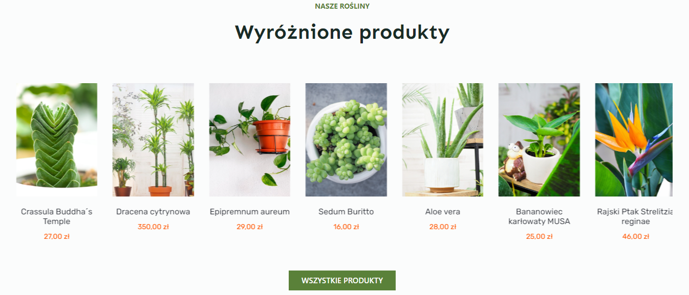
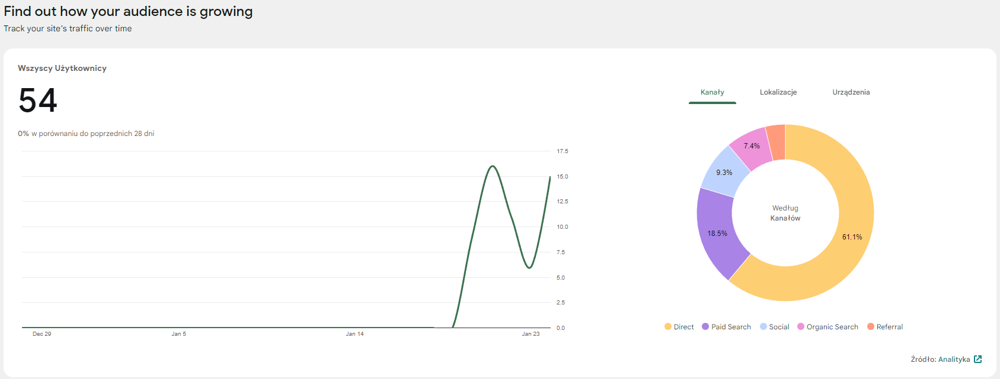
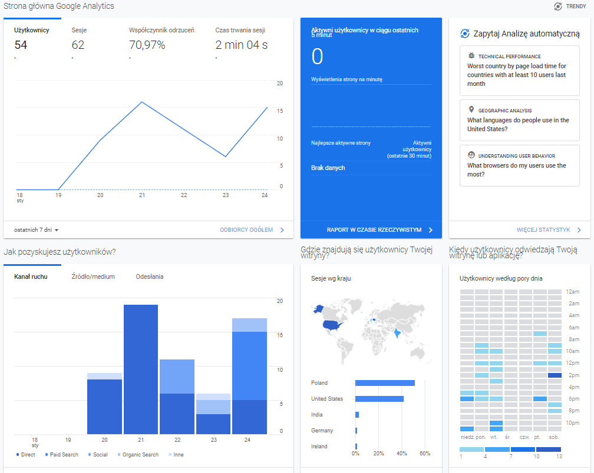
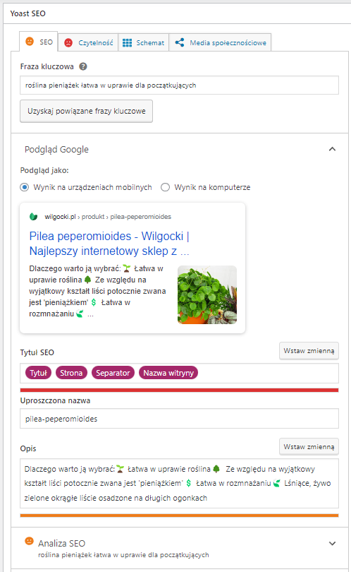

# sklep

<h1>Poradnik: Jak stworzyć sklepinternetowy</h1>

<h2>Krok 1 – Domena</h2>
Aby stworzyć sklep internetowy, musisz najpierw kupić domenę. Ja kupuję domeny na
home.pl. Następnie musisz utworzyć pocztę z własną domeną sklep@twojadomena.pl.
Możesz skorzystać z bezpłatnej usługi Zoho, aby to zrobić. Na Zoho będziesz musiał dodać
różne rekordy DNS, aby potwierdzić, że twoja domena jest twoja. Możesz to zrobić w panelu
home.pl dodając rekordy typu MX lub TXT.

<h2>Krok 2 - Poczta mailowa z własną domeną sklep@twojadomena.pl</h2>
1. Zarejestruj się na zoho.pl i utwórz konto z własną domeną. Poradnik:
https://www.zoho.com/mail/help/adminconsole/add-domains.html

2. Potwierdź że to twoja domena dodając różne rekordy DNS. W panelu na home.pl
przejdź do zakładki domeny > działania > zarządzaj rekordami DNS > dodaj nowy
rekord. Wybierz odpowiedni rekord, wklej wartości i potwierdź weryfikację na zoho.

3. Powtórz to ze wszystkimi DNSami o które prosi zoho.

4. Sprawdź czy maile przychodzą do skrzynki i czy można wysyłać i czy wiadomości
nie wpadają do spamu (między np. kontem gmail a zoho).

<h2>Krok 3 – WordPress</h2>
Kolejnym krokiem jest zainstalowanie WordPressa na maszynie wirtualnej. Możesz to zrobić
np. na DigitalOcean lub Microsoft Azure, Google Cloud lub AWS.
(https://marketplace.digitalocean.com/apps/wordpress) Po wybraniu konfiguracji maszyny i
włączeniu jej, musisz połączyć ją z twoją domeną w panelu home.pl jako rekord A.
Następnie musisz się zalogować do maszyny przez SSH, aby przejść przez krótki etap
konfiguracji. Po tym, jak maszyna jest już skonfigurowana, tworzysz użytkownika
WordPressa i logujesz się do kokpitu.

<h2>Krok 4 – WooCommerce</h2>
Kolejnym krokiem jest zainstalowanie motywu Blocksy Child oraz wtyczek Elementor i
WooCommerce. Wybierz templatkę sklepu i edytuj wszystko według potrzeb. Dodaj swoje
logo, zdjęcia, stopkę, nagłówek itp. Polecam skorzystać z ChatGPT do opisów na stronie, a
zdjęcia wziąć np. z pexels tak, aby nie było problemów z prawami autorskimi. Zalecam także
zainstalowanie wtyczki Woocommerce Product Ultimate, aby poprawić prezentację
produktów na stronie. 

Innymi przydatnymi wtyczkami są
● WooCommerce Stripe Gateway (https://stripe.com/en-pl), 
● Smush, 
● LoftLoader, 
● Site Kit od Google, 

polecam też google analytics 

● InpostPaczkomatyPlugin,  
● Yoast SEO 

<h2>Krok 5 – Maile</h2>
Musisz ustawić wtyczkę MailPoet, aby móc wysyłać maile odnośnie zamówień do klientów.
Ustaw treść maili w zakładce woocommerce > ustawienia > emaile.

<h2>Krok 6 – Marketing</h2>
Aby sklep odniósł sukces, musisz przeprowadzić kampanie reklamowe. Zainstaluj wtyczkę
Google Listings and Ads i przygotuj kampanię reklamową. Zainwestuj również w reklamy na
Facebooku i Instagramie (na Pintereście witryna musi mieć przynajmniej 9 miesięcy). Aby to
zrobić, musisz mieć już zrobione regulaminy sklepu i politykę prywatności.

<h2>Mój sklep</h2>
https://youtu.be/Sdf28Gdgzpw

<h2>Zakończenie</h2>
Jeśli masz jakieś pytania, chętnie pomogę.
